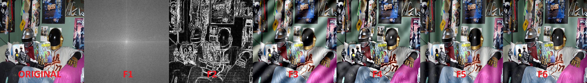

# Image Processing with Fourier and Laplacian Filters

A graphical application for processing and filtering images using spatial and frequency domain techniques, built with Python, OpenCV, and Tkinter.

## Description

This project allows you to explore image enhancement and noise filtering using several key operations:

- Visualization of the Fourier Transform magnitude spectrum  
- Addition and removal of sinusoidal noise using notch filters  
- Application of the Laplacian operator for edge detection  
- Interactive blending between original and filtered images  
- Simple Tkinter GUI for loading, displaying, and saving images

These functionalities are ideal for experimenting with frequency-based filtering and sharpening techniques.

## Demo

The following example shows various processing steps applied to an input image:

